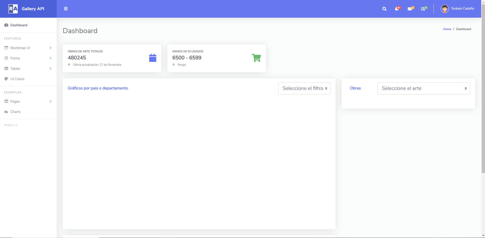
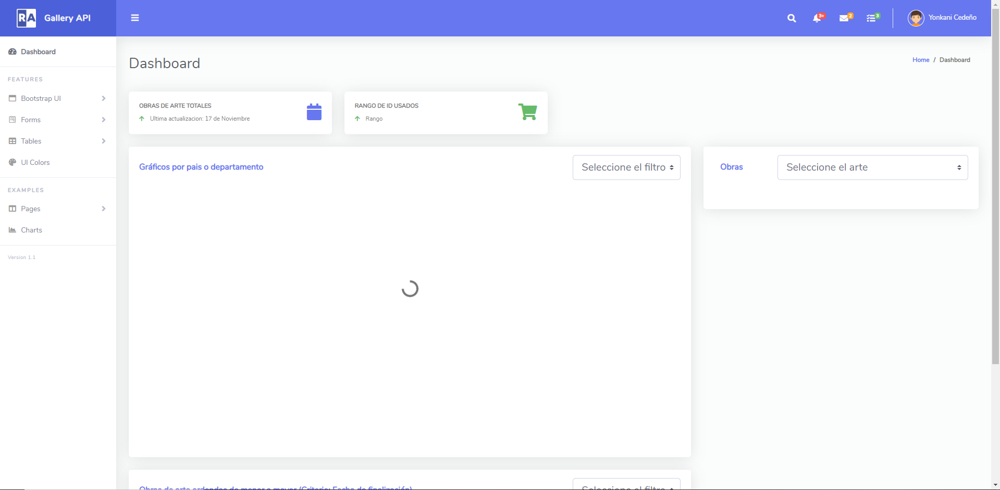
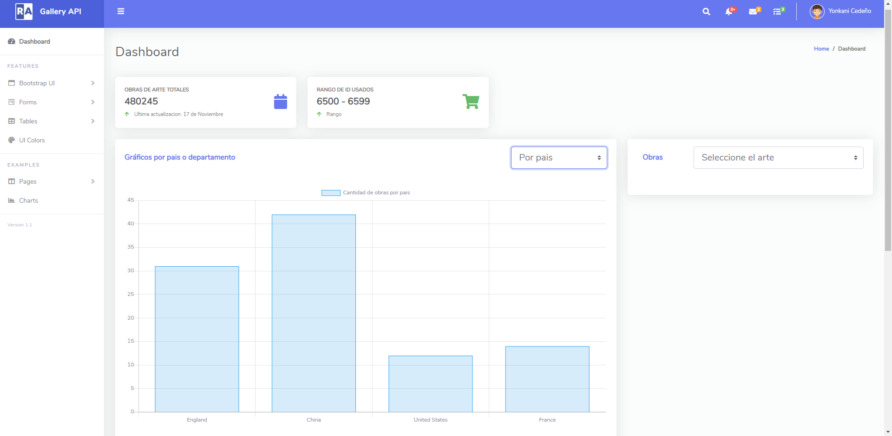
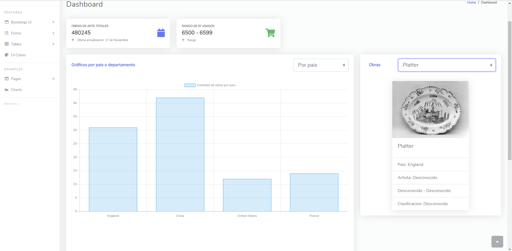
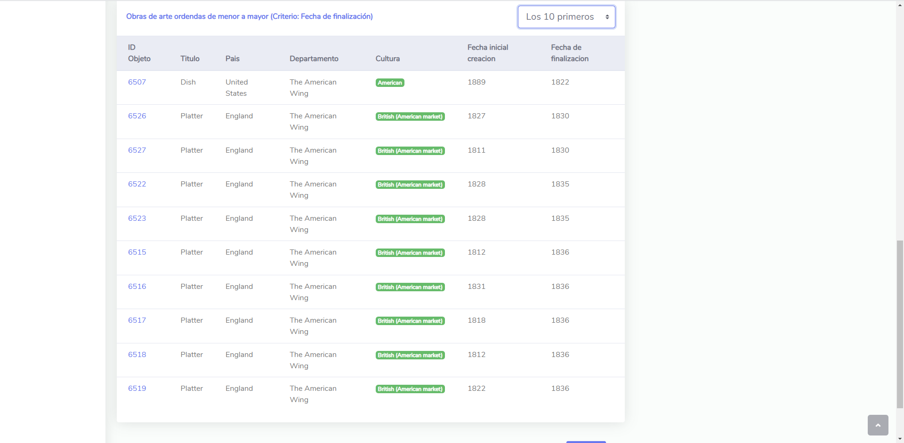

# API Galeria de Arte

Enlace a la API: ```https://metmuseum.github.io/```

-------------------

**API Galeria de Arte** es un proyecto que tiene la finalidad de obtener datos a traves de una API pública y mostrarlos dinámicamente

**Importante**

El siguiente enlace trae una lista de los ID disponibles: ```https://collectionapi.metmuseum.org/public/collection/v1/objects```

Los datos traidos de la API se realizan de forma individual pasando al URL el ID correspondiente.
```https://collectionapi.metmuseum.org/public/collection/v1/objects/[objectID]```

**Carga de datos**
El archivo que debe abrirse es **index.html**. Una vez abierto aparecerá un spinner desaparecerá una vez los datos se hayan cargado en el navegador.

- Las peticiones se realizan de manera individual por lo que se ha optado por traer **100 objectos**.
- El tiempo de carga es de **30 segundos**.
- Los objectos se almacenan en un array en **localStorage**.

- Es importante recargar la pagina una vez termine el spinner.
 
## Capturas
**Pantalla Principal**


**Cargando datos**


**Filtrado por pais**
Existen dos tipos de filtrado:
- Por pais.
- Por cultura.


**Datos de la obra**
Obtiene todas las obras disponibles con el siguiente formato:

    {
        objectID: number,
        title: string,
        primaryImageSmall: string,
        country: string,
        accesionYear: string,
        repository: string,
        isHighlight: boolean,
        isPublicDomain: boolean,
        department: data.department,
        culture: data.culture,
        artistDisplayName: string,
        artistDisplayBio: string,
        artistBeginDate: string,
        artistEndDate: string,
        objectBeginDate: int,
        objectEndDate: int,
        classification: string

      }
    



**Tabla obras**
La tabla se encuentra ordenada de manera ascendente por el atributo ```objectEndDate```.
Existen 3 tipos de filtros:
- 3 primeros
- 10 primeros
- Todos


## Contribution 

El recurso plantillas fue tomado de: 

- Enlace: ```git clone https://github.com/indrijunanda/RuangAdmin.git```


## Integrated

- **[Animate.css](https://animate.style/)** para las animaciones.


-------------------
### Cheers Up!

*Happy Developing* 💪


😁😁


