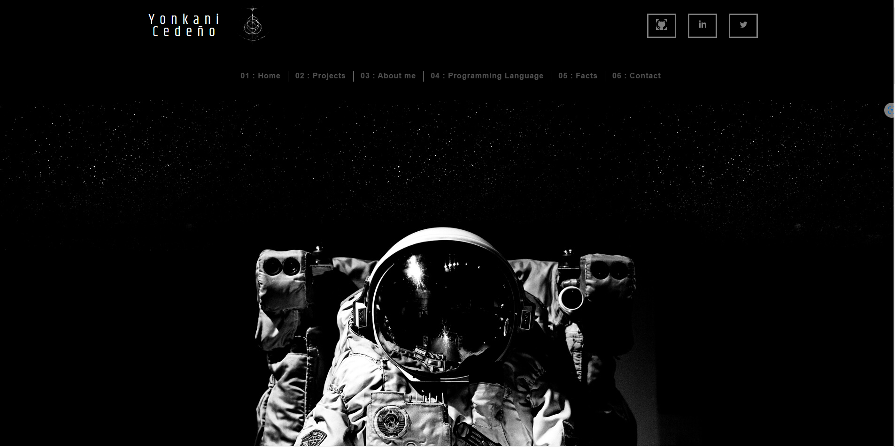
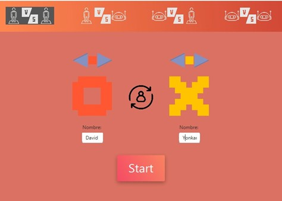
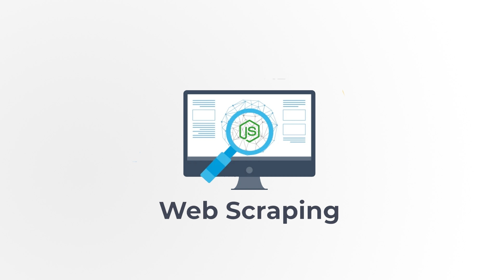

# Portafolio
Yonkani Cedeño Garcia

#Página principal

##Proyectos

### Juego de Tic Tac Toe

Proyecto que se basó en el uso del algoritmo mini-max aplicado a árboles multicaminos. El algoritmo se basa en la
obtención de la máxima utilidad y la menor perdida. Se escribió en Java y se hizo uso de JavaFx para realizar la
interfaz gráfica.

### Scrapping de datos con Ruby

Proyecto que se llevó a cabo durante el segundo parcial de Lenguajes de Programación. Haciendo uso de la gema Nokogiri
se obtuvo datos del Html de páginas previamente elegidas con la finalidad de realizar una análisis de datos y su representación
respectiva.

### API usando el stack MERN

### API usando el stack MERN
Proyecto personal que comprende la realización de una API de consulta estudiantes mediando peticiones GET, POST, DELETE,
PUT. La interfaz gráfica se pretende construir bajo el conocimiento básico de React.

### Analizador léxico y sintáctico de Javascript.

Proyecto del primer parcial de lenguajes de programación. El objetivo es codificar un analizador léxico y sintáctico para el
lenguaje de programación JavaScript. Sus funcionalidades van desde el análisis de variables, operadores, estructuras de control,
funciones, estructuras de datos y el análisis sintáctico de un programa principal.

## Referencias 

* https://github.com/bradtraversy/design-resources-for-developers
* https://colorhunt.co/
* https://fonts.google.com/?query=roboto
* https://fontawesome.com/icons

## Recursos adicionales
* Soundtrack Elden Ring main theme